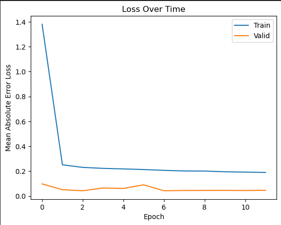
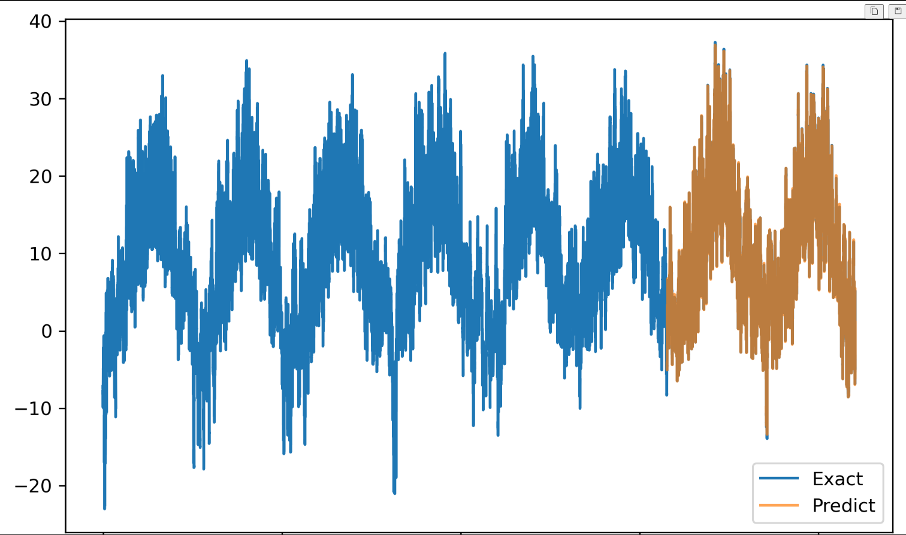
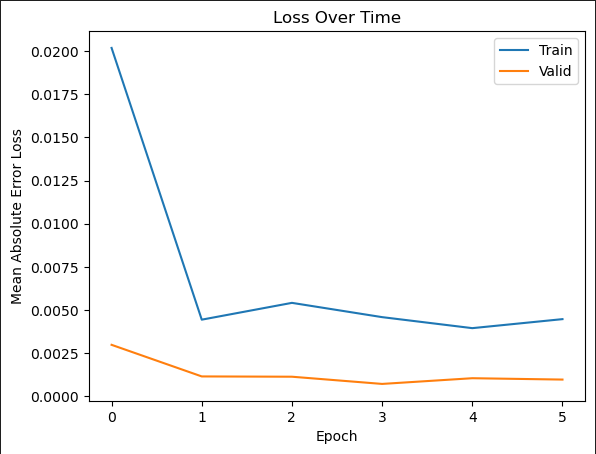
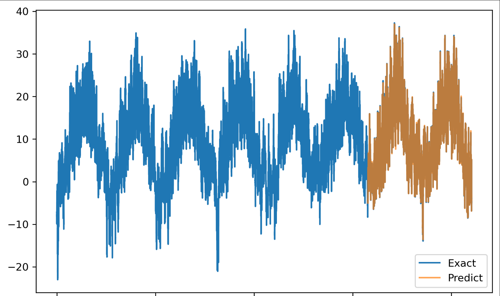

# Reporte

## Parte 1

Para la temperatura a partir de únicamente las temperaturas pasadas tuve resultados buenos para la función de costo,

Lo cual sí resultó en hacer buenas predicciones,

en alrededor de 15 épocas.

## Parte 2

No obstante, la temperatura a partir de todos los datos salieron muchísimo mejor,

Lo cual dió bastante buenos resultados también,

en tan solo 6 épocas.